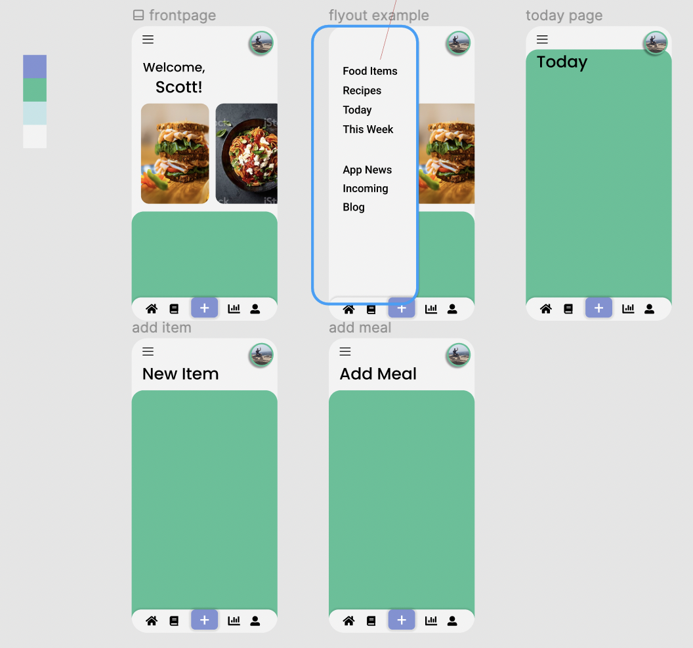

# NutriApp
Nutrition tracking app that uses methods and upgrades the tools I used with clients as a fitness professional. 
Two common issues that I hope to solve with this app are:
1) The lack of compatibility with whole foods
2) The lack of flexibility of measurements. I used a certain 'ballpark' method that I would like to try and put into the app

- uses .NET Standard, Xamarin.forms, and SQL SERVER (via Azure Data Studio). Made with Visual Studio for Mac

## To Run (currently dev / debug only):
- clone repo, open in Visual Studio
- Right click on solution, 'Restore Nuget Packages'
- Build all and Run

## v.0.1 Feature Objectives
- [ ] be able to add food items and remove items that you added
- [ ] be able to add meals and view the meals eaten by the day and week, (plus search for a day)
- [ ] be able to add 'ballparks' to be used as custom measurements
- [ ] have Home, Guidelines, Items, Today, and User pages (functional and looking decent)

## After that
- better login and 'forgot password' logic
- add/ remove recipes
- push local recipes from 'local' to 'shared'
- push local food items from 'local' to 'shared'
- track body stats and calculate recommendations based on common goal presets

# Tasks
- [ ] Set up code-first db connection to sql server docker image (using EFcore.SqlServer)
- [ ] Make pages using XAML
- [ ] Make default food item data
- [ ] Design/code the 'local' and 'shared' system 
